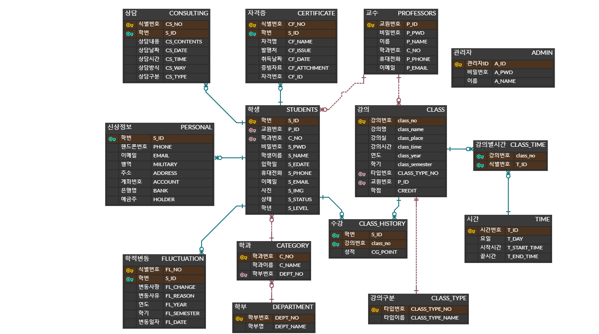

# sundea-univ_semiProject
목차
---
- 프로젝트 소개 및 기획의도
- 유사프로그램 분석
- 요구사항 및 주요기능
- ERD
- 개발일정 및 개발환경
- 역할분담
- 코드리뷰_상예진
- 소감


  
프로젝트 소개 및 기획의도
---
수도권 인구 밀집 현상으로 인한 충북 충주시 청년층의 감소로 전통있던 휴수의 대학교 두 곳이 급작스레 폐교하는 상황에 처해있습니다. 이런 상황에서도 살아남은 순대학교를 위한 새로운 학사 정보 관리페이지가 필요합니다. 기존의 학사 관리 프로그램을 분석하여 순대학교의 자체 학사 관리 프로그램을 구현할 예정입니다(가상의 설정)


  
유사프로그램 분석
---
1. 충O대학교 학사 관리 시스템
2. 인O대학교 학사 관리 시스템
3. 교O대학교 학사 관리 시스템

__분석 결과__
1. 학생과 교원을 위한 성적 관리 페이지 제공
2. 교원을 위한 상담 관리 페이지 제공
3. 개인 학전 조회 페이지 제공

__차별성__
1. 불필요한 기능을 출여 간소화
2. 사용자 친화적인 UI/UX


  
요구사항 및 주요기능
---
- 학생
 - 상담조회/성적조회/학적조회
- 교수
 - 성적관리/상담관리/강의조회
- 관리자
 - 학생관리/교수관리/강의관리   


  
ERD
---



  
개발일정 및 개발환경
---
### 개발일정
__1. 기획 및 1차 보고(~8/2)__
  - 기획안 작성 및 아이디어 회의
  - 유스케이스, 클래스다이어그램 작성 및 역할분담
  - Guthub 설정

__2. DB설계(~8/9)__
  - 테이블기술서/엔티티기술서/요구사항정의서 작성  

__3. 구현(~8/27)__
  - 데이터베이스 구현
  - 프로그램 구현

__4. 발표준비(~9/1)__
  - 프레젠테이션 및 발표영상 준비
  
### 개발환경
- 운영체제 : Window 10
- 개발도구 : Eclipse
- DBMS : Oracle DB - sqldeveloper
- Server : Apache Tomcat 8.5
- Language : Java, HTML5, CSS3, Javascript, JQuery, Servlet, JSP
    
    
      
역할분담
---
- 이윤정(팀장)
  - 로그인, 로그아웃, 비밀번호 초기화 및 변경, 학번 및 교원번호 찾기
  - 메뉴바
  - 교수 페이지
- 김성대(팀원)
  - 관리자 페이지 : 강의/교수 리스트 관리
- 왕수빈(팀원)
  - 관리자 페이지 : 학생 리스트 관리, 강의 관리
  - 학생 페이지 : 학적 조회 상세보기
- 상예진(팀원)
  - 메인 페이지
  - 학생 페이지 : 학적/상담/성적 조회, 증명서 발급


  
코드리뷰_상예진
---
[](https://youtu.be/eg9A1bVgywI?t=0s) 
  
__코드 리뷰에 앞서.. 제가 담당한 파트는..?__
- 학생 상담 조회
- 학생 성적 조회
- 학생 학적 조회
- 증명서 발급 시 링크 이동
- 로그인 후 메인 페이지(지도, 달력, 날씨정보 구현)
  
---
__1. 학생 상담 조회__

학생으로 로그인 시 해당 학생의 상담내역을 조회 할 수 있습니다. 메뉴바에서 상담을 클림하면 지도교수와 함께 상담내역을 출력하도록 구현하였습니다. 
```
//Controller
	protected void doGet(HttpServletRequest request, HttpServletResponse response) throws ServletException, IOException {
		User user=(User)request.getSession().getAttribute("loginUser");
		
		ArrayList<StudentConsulting> list = new StudentService().student_consultingList(user.getUserId());
		String advisor = new StudentService().searchAdvisor(user.getUserId());
		request.setAttribute("advisor", advisor);
		request.setAttribute("list", list);
		request.getRequestDispatcher("views/student/student_consulting.jsp").forward(request, response);
	}
 
 //Dao
  public ArrayList<StudentConsulting> student_consultingList(Connection conn, String userId) {
		ArrayList<StudentConsulting> list = new ArrayList<StudentConsulting>();
		PreparedStatement pstmt = null;
		ResultSet rset = null;

		String sql = prop.getProperty("student_consultingList");

		try {
			pstmt = conn.prepareStatement(sql);
			pstmt.setString(1, userId);
			rset = pstmt.executeQuery();

			while (rset.next()) {
				list.add(new StudentConsulting(rset.getInt("CS_NO"), rset.getString("CS_CONTENTS"),
						rset.getDate("CS_DATE"), rset.getString("CS_TIME"), rset.getString("CS_WAY"),
						rset.getString("CS_TYPE")));
			}
		} catch (Exception e) {
			e.printStackTrace();
		} finally {
			close(rset);
			close(pstmt);
		}
		return list;
	}
 
 //student-query.properties
 student_consultingList=SELECT CS_NO, CS_CONTENTS, CS_DATE, CS_TIME, CS_WAY, CS_TYPE FROM CONSULTING WHERE S_ID = ?
```


      
__2. 학생 성적 조회__

학생으로 로그인 시 해당 학생의 성적을 조회 할 수 있습니다. 메뉴바에서 성적을 클릭하면 학기별 성적과 이수구분별 성적을 조회 할 수 있습니다. 각각의 전공합계, 교양합계, 총합계 등 필요한 값을 계산하고 필요에 따라서 DB에서 새로운 view를 생성하여 사용하였습니다.

    
#### 2-1. 이수구분별 성적 
```
//Dao
	public ArrayList<StudentDivisionGrade> student_divisionGrade(Connection conn, String userId) {
		ArrayList<StudentDivisionGrade> list = new ArrayList<StudentDivisionGrade>();
		PreparedStatement pstmt = null;
		ResultSet rset = null;

		String sql = prop.getProperty("student_divisionGrade");

		try {
			pstmt = conn.prepareStatement(sql);
			pstmt.setString(1, userId);
			rset = pstmt.executeQuery();

			while (rset.next()) {
				list.add(new StudentDivisionGrade(rset.getInt("TYPENO"), rset.getInt("CREDIT")));
			}
		} catch (Exception e) {
			e.printStackTrace();
		} finally {
			close(rset);
			close(pstmt);
		}
		return list;
	}
 
 //student-query.properties
 student_divisionGrade=SELECT TYPENO, CREDIT FROM VIEW_ST_GRADE WHERE S_ID=?

		/* --학생성적조회 뷰 VIEW_ST_GRADE
     CREATE OR REPLACE VIEW VIEW_ST_GRADE AS
     SLEELCT H.S_ID "S_ID", C.CLASS_TYPE_NO AS "TYPENO", SUM(C.CREDIT) "CREDIT"
     FROM CLASS C
     JOIN CLASS_HISTORY H ON C.CLASS_NO = H.CLASS_NO
     GROUP BY C.CLASS_TYPE_NO, H.S_ID;
		*/
   
 //JSP
 				<tbody>
        <tr>
           <th style="text-align: center;">취득 학점</th>
              <%if(list.isEmpty()){ %>
                  <td colspan="9" style="text-align: center;">존재하는 성적 내역이 없습니다</td>
              <%} else { %>
                  <%for(StudentDivisionGrade sdg: list){ %>
                      <%if(sdg.getClassTypeNo()==1){ %>
                          <% prerequisiteEss=sdg.getClassCreditSum();%>
                          <% preSum += sdg.getClassCreditSum(); %>
                      <%}else if(sdg.getClassTypeNo()==2){ %>
                          <% prerequisiteSel=sdg.getClassCreditSum();%>
                          <% preSum += sdg.getClassCreditSum(); %>
                      <%}else if(sdg.getClassTypeNo()==3){ %>
                          <% electiveEss=sdg.getClassCreditSum();%>
                          <% eleSum += sdg.getClassCreditSum(); %>
                      <%}else if(sdg.getClassTypeNo()==4){ %>
                          <% electiveSel=sdg.getClassCreditSum();%>
                          <% eleSum += sdg.getClassCreditSum(); %>
                      <%}else if(sdg.getClassTypeNo()==5){ %>
                          <% industry=sdg.getClassCreditSum();%>
                      <%}else if(sdg.getClassTypeNo()==6){ %>
                          <% free=sdg.getClassCreditSum();%>
                      <%} %>
                   <% totalSum+=sdg.getClassCreditSum(); %>
                  <%} %>
                  <td style="text-align: center;"><%= prerequisiteEss %></td>
                  <td style="text-align: center;"><%= prerequisiteSel %></td>
                  <td style="text-align: center;"><%= electiveEss %></td>
                  <td style="text-align: center;"><%= electiveSel %></td>
                  <td style="text-align: center;"><%= industry %></td>
                  <td style="text-align: center;"><%= free %></td>
                  <td style="text-align: center;"><%= preSum %></td>
                  <td style="text-align: center;"><%= eleSum %></td>
                  <td style="text-align: center;"><%= totalSum %></td>
           <%} %>
        </tr>
				</tbody>
```

    
#### 2-2. 학기별 성적 조회
```
//Dao
	public ArrayList<StudentSemeterGrade> student_semesterGrade(Connection conn, String userId) {
		ArrayList<StudentSemeterGrade> SList = new ArrayList<StudentSemeterGrade>();
		PreparedStatement pstmt = null;
		ResultSet rset = null;

		String sql1 = prop.getProperty("student_semesterGrade");
  
		try {
			pstmt = conn.prepareStatement(sql1);
			pstmt.setString(1, userId);

			rset = pstmt.executeQuery();

			while (rset.next()) {
				SList.add(new StudentSemeterGrade(rset.getInt("YEAR"), rset.getInt("SEMESTER"), rset.getInt("CREDIT"),
						rset.getDouble("CG_POINT"), rset.getDouble("PERCENT")));
			}
		} catch (Exception e) {
			e.printStackTrace();
		} finally {
			close(rset);
			close(pstmt);
		}
		return SList;
	}
 
 //student-query.properties
 student_semesterGrade=SELECT YEAR, SEMESTER, CREDIT, CG_POINT, PERCENT FROM VIEW_ST_APPLI WHERE S_ID=?
 
 		/* --학생신청학점조회 뷰 VIEW_ST_APPLI
     CREATE OR REPLACE VIEW VIEW_ST_APPLI AS
     SLEELCT H.S_ID "S_ID", 
             C.CLASS_YEAT "YEAR",
             C.CLASS_SEMESTER "SEMESTER",
             SUM(C.CREDIT) "CREDIT",
             AVG(H.CG_POINT) "CG_POINT",
             (AVG(H.CG_POINT)-2)*12+70 "PERCENT"
     FROM CLASS_HISTORY H
     JOIN CLASS C ON H.CLASS_NO = C.CLASS_NO
     GROUP BY C.CLASS_YEAR, C.CLASS_SEMESTER, H.S_ID
     ORDER BY 1,2;
		*/
  
 		/* --학생취득학점조회 뷰 VIEW_ST_EARN
     CREATE OR REPLACE VIEW VIEW_ST_EARN AS
     SLEELCT SUM(C.CREDIT) "CREDIT", H.S_ID "S_ID"
     FROM CLASS C
     JOIN CLASS_HISTORY H ON C.CLASS_NO = H.CLASS_NO
     WHERE H.CG_POINT IS NOT NULL
     GROUP BY C.CLASS_YEAR, C.CLASS_SEMESTER, H.S_ID
     ORDER BY C.CLASS_YEAR, C.CLASS_SEMESTER;
		*/

 		/* --학생전공석차조회 뷰 VIEW_ST_RANK
     CREATE OR REPLACE VIEW VIEW_ST_RANK AS
     SLEELCT H.S_ID "S_ID",
             S.C_NO "C_NO",
             C.CLASS_YEAT "YEAR",
             C.CLASS_SEMESTER "SEMESTER",
             AVG(H.CG_POINT) "AVG",
             DENSE_RANK() OVER(PARTITION BY S.C_NO, C.CLASS_YEAR, C.CLASS_SEMESTER ORDER BY AVG(H.CG_POINT) DESC) "RANK"
     FROM CLASS_HISTORY H
     JOIN STUDENT S ON H.S_ID = S.S_ID
     JOIN CLASS C ON H.CLASS_NO = C.CLASS_NO
     GROUP BY S.C_NO, C.CLASS_YEAR, C.CLASS_SEMESTER, H.S_ID
     ORDER BY S.C_NO, C.CLASS_YEAR, C.CLASS_SEMESTER;
		*/
```

  
    
__3. 학생 학적 조회__

학생으로 로그인 시 해당 학생의 학적을 조회 할 수 있습니다. 메뉴바에서 학적을 클릭하면 학적조회가 가능하며 기본 학적, 신상, 계좌에 대한 정보를 조회 할 수 있습니다. 그리고 서브메뉴로 신상정보 수정, 학적변동 조회, 수강내역 조회, 외부 자격증 조회/추가/삭제가 가능합니다. 저는 학적조회의 첫 화면인 학적, 신상, 계좌 정보를 조회하고 서브메뉴의 매핑까지 프로젝트를 진행하였습니다. 신상정보는 학생이 개인정보를 수정해야 조회 가능하기 때문에 해당 학생의 신상정보가 없는 경우는 신상정보 수정 페이지로 자동으로 넘어가도록 구현했습니다.

```
//Controller
	protected void doGet(HttpServletRequest request, HttpServletResponse response) throws ServletException, IOException {
     User user=(User)request.getSession().getAttribute("loginUser");
     Student st = new StudentService().selectStudent(user.getUserId());
     Student stp = new StudentService().studentPersonalselect(user.getUserId());

     if(st ==null || stp==null) {
         request.getSession().setAttribute("msg", "조회할 신상 정보가 존재하지 않습니다. 신상 등록 페이지로 넘어갑니다.");
         request.getRequestDispatcher("views/admin/student/aintGotInfo.jsp").forward(request, response);
     }else {
         request.setAttribute("stp", stp);
         request.setAttribute("st", st);
         request.getRequestDispatcher("views/admin/student/stmenu.jsp").forward(request, response);
     }
 	}
  
//Dao
 	public Student studentPersonalselect(Connection conn, String userId) {
		Student per = null;
		PreparedStatement pstmt = null;
		ResultSet rset = null;

		String sql = prop.getProperty("studentPersonalselect");
		
		try {
			pstmt = conn.prepareStatement(sql);
			pstmt.setString(1, userId);

			rset = pstmt.executeQuery();

			if(rset.next()) {
				per = new Student(rset.getString("MILITARY"),
								  rset.getString("ADDRESS"),
								  rset.getString("ACCOUNT"),
								  rset.getString("BANK"),
								  rset.getString("HOLDER"));
			} 
		} catch (Exception e) {
			e.printStackTrace();
		} finally {
			close(rset);
			close(pstmt);
		}
		return per;
	}
 
 //student-query.properties
 studentPersonalselect=SELECT * FROM ST_PERSONAL WHERE S_ID=?
```

  
    
__4. 증명서 발급 시 링크 이동__

학생으로 로그인 시 메뉴바의 증명서발급을 클릭하면 민원24페이지로 새로운 창이 열리면서 페이지 이동이 됩니다.
```
//menubar.jsp
	<ul>
		<li><div id = "4" class="menuLink" onclick="goStudentRegister();">학적</div></li>
		<li><div id = "4" class="menuLink" onclick="goStudentConsulting();">상담</div></li>
		<li><div id = "4" class="menuLink" onclick="goStudentGrade();">성적</div></li>
		<li><div id = "4" class="menuLink" onclick="goCertification('https://www.webminwon.com/#reload');">증명서발급</div></li>
	</ul>
 
 <script>
   function goCertification(url) {
         var win = window.open(url, '_blank');
         win.focus();
   }
 </script>
```


  
__5. 로그인 후 메인 페이지(지도, 달력, 날씨정보 구현)__

순대학교 학사 정보 관리 시스템에 로그인하면 맨처음 보여지는 인덱스페이지에 지도와 달력 날씨정보를 API와 HTML을 활용해서 구현해보았습니다.

  
#### KakaoMap API
```
			<script type="text/javascript" src="//dapi.kakao.com/v2/maps/sdk.js?appkey=[발급받은 key번호]"></script>
			<script>
				var mapContainer = document.getElementById('map'),
				    mapOption = { 
				        center: new kakao.maps.LatLng(37.5064613, 127.0320657),
				        level: 5 
				    };
				
				var map = new kakao.maps.Map(mapContainer, mapOption); 
				var points = [
				    new kakao.maps.LatLng(37.5064613, 127.0320657),
				];
				
				var bounds = new kakao.maps.LatLngBounds();    
				var i, marker;
				for (i = 0; i < points.length; i++) {
				    marker =     new kakao.maps.Marker({ position : points[i] });
				    marker.setMap(map);
				    
				    bounds.extend(points[i]);
				}
				
				function setBounds() {
				    map.setBounds(bounds);
				}
			</script>
```

  
#### openweatherMap API
```
		<script src="https://code.jquery.com/jquery-3.6.0.min.js" integrity="sha256-/xUj+3OJU5yExlq6GSYGSHk7tPXikynS7ogEvDej/m4=" crossorigin="anonymous"></script>
  <div class="weather">
     <div class="icon" ></div><!--  -->
     <div class="content"></div>
  </div>
  <script>
     $.getJSON('http://api.openweathermap.org/data/2.5/weather?q=Seoul&APPID=[발급받은 key번호]=metric' ,function(result){
        var wIconUrl = ''
        $('.icon').html(wIconUrl);
        var ct = result.dt;
        var currentTime = convertTime(ct);
        function convertTime(t){
            var ot = new Date(t*1000);

            return ot.toLocaleString();
        }

        $('.content').append(result.sys.country+', '+result.name+' '+result.weather[0].description+'<br>'+currentTime+'<br>'+result.main.temp+' º');
     });
		</script>
```

  
#### calender HTML
```
			<table id="calendar" align="center">
			    <tr>
			        <td><label onclick="prevCalendar()"><</label></td>
			        <td align="center" id="tbCalendarYM" colspan="5">yyyy년 m월</td>
			        <td><label onclick="nextCalendar()">></label></td>
			    </tr>
			    <tr>
			        <td align="center"><font color ="red">일</td>
			        <td align="center">월</td>
			        <td align="center">화</td>
			        <td align="center">수</td>
			        <td align="center">목</td>
			        <td align="center">금</td>
			        <td align="center"><font color ="red">토</td>
			    </tr> 
			</table>
   
   <script type="text/javascript">
       var today = new Date();
       var date = new Date();

       function prevCalendar() {
        today = new Date(today.getFullYear(), today.getMonth() - 1, today.getDate());
        buildCalendar();
       }

       function nextCalendar() {
            today = new Date(today.getFullYear(), today.getMonth() + 1, today.getDate());
            buildCalendar();
       }
       function buildCalendar(){
           var doMonth = new Date(today.getFullYear(),today.getMonth(),1);
           var lastDate = new Date(today.getFullYear(),today.getMonth()+1,0);

           var tbCalendar = document.getElementById("calendar");
           var tbCalendarYM = document.getElementById("tbCalendarYM");

           tbCalendarYM.innerHTML = today.getFullYear() + "년 " + (today.getMonth() + 1) + "월"; 

           while (tbCalendar.rows.length > 2) {
                 tbCalendar.deleteRow(tbCalendar.rows.length-1);
            }
            var row = null;
            row = tbCalendar.insertRow();

            var cnt = 0;

            for (i=0; i<doMonth.getDay(); i++) {
                 cell = row.insertCell();
                 cnt = cnt + 1;
            }

            for (i=1; i<=lastDate.getDate(); i++) { 
                 cell = row.insertCell();
                 cell.innerHTML = i;
                 cnt = cnt + 1;
             if (cnt % 7 == 1) {
               cell.innerHTML = "<font color=red>" + i
           }    
             if (cnt%7 == 0){
                 cell.innerHTML = "<font color=red>" + i
                  row = calendar.insertRow();
             }
             if (today.getFullYear() == date.getFullYear()
                && today.getMonth() == date.getMonth()
                && i == date.getDate()) {
               cell.bgColor = "#FAF58C";
              }
            }
       }
   </script>
```

  
소감
---
역할분담을 나누다 보니 select문만 사용한 것이 아쉬웠지만 그래도 머리에서 둥둥 떠다니던 지식들을 활용해서 실제로 무언가를 구현해내는 것에서 성취감을 많이 느꼈습니다. 본격적으로 해본 프로젝트에서 제 몫을 다하기 위해서 매일 고군분투하고 팀원들과 함께 문제를 해결해나가는 점이 힘들면서도 너무나 뿌듯했습니다. 시간이 조금만 더 주어졌다면 메인페이지를 좀 더 퀄리티있게 했으면하는 아쉬움이 남지만 이를 발판 삼아서 다음 프로젝트에서는 좀 더 다양한 기능들을 멋지게 구현해보고 싶습니다.  
